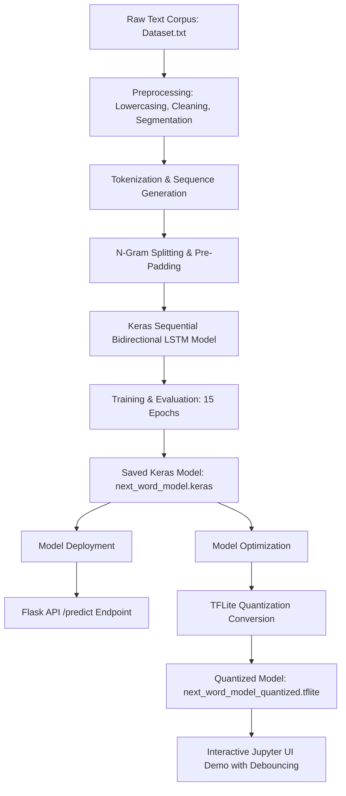

# Contextual Autocomplete and Sentence Completion

[](https://www.python.org/)
[](https://www.tensorflow.org/)
[](https://keras.io/)
[](https://flask.palletsprojects.com/)
[](https://opensource.org/licenses/MIT)

An end-to-end deep learning project focused on building, optimizing, and deploying a **Next-Word Prediction and Sentence Autocomplete system**. The project utilizes a **Bidirectional LSTM (Long Short-Term Memory)** network trained on a custom text corpus, implements a sophisticated **Beam Search** decoding strategy, and is optimized for real-time mobile/edge devices using **TensorFlow Lite (TFLite) quantization**. Finally, the model is exposed via a **Flask API** and demonstrated through an interactive **Jupyter Widgets UI with debouncing**.

---

## 📖 Table of Contents
1. [Key Features](#-key-features)
2. [Project Architecture](#%EF%B8%8F-project-architecture)
3. [Technology Stack](#-technology-stack)
4. [Dataset & Data Preprocessing](#-dataset--data-preprocessing)
5. [Model Architecture & Training](#-model-architecture--training)
6. [Decoding Strategies (Greedy vs. Beam Search)](#-decoding-strategies-greedy-vs-beam-search)
7. [Model Optimization (TFLite Quantization)](#-model-optimization-tflite-quantization)
8. [API Deployment & Interactive Demo](#-api-deployment--interactive-demo)
9. [Getting Started](#-getting-started)
10. [Usage Examples](#-usage-examples)
11. [Insights and Future Improvements](#-insights-and-future-improvements)

---

## 🌟 Key Features

* **Bidirectional LSTM Model:** Captures context from both past and future words in a sequence for more robust text completion.
* **Beam Search Decoding:** Explores multiple high-probability prediction paths simultaneously to produce coherent sentences instead of simple greedy token choices.
* **TFLite Quantization:** Converts a heavy 32-bit floating-point Keras model to a highly optimized 8-bit integer TFLite format, reducing latency and model footprint.
* **Flask API Microservice:** Provides a `/predict` endpoint that serves predictions dynamically over HTTP.
* **Debounced Interactive UI:** Features a rich in-notebook application built with `ipywidgets` utilizing a threading-based debouncer to prevent excessive inference calls during active typing.

---

## 🛠️ Technology Stack

* **Programming Language:** Python 3
* **Deep Learning Framework:** TensorFlow & Keras
* **Natural Language Processing:** NLTK
* **Data Processing & Visualization:** NumPy, Pandas, Matplotlib, Seaborn, Scikit-learn
* **Deployment & Inference:** Flask, TensorFlow Lite
* **Interactive UI:** ipywidgets

---

## 🏗️ Project Architecture



---

## 📊 Dataset & Data Preprocessing

The model is trained on a custom text corpus ([Dataset.txt](file:///d:/Education/Internships/Xeta/Project%20Report/Dataset.txt)) containing structured sentences.

### Preprocessing Pipeline:
1. **Sentence Segmentation:** Raw text is split into individual sentences using line breaks.
2. **Text Cleaning:** Removing excess whitespaces and dropping empty strings.
3. **Normalization:** Converting all characters to lowercase to decrease overall vocabulary complexity.
4. **Tokenization:** Fitting a Keras Tokenizer with an out-of-vocabulary (`<oov>`) token.
5. **N-Gram Generation:** Generating sequence fragments. For example, for the sentence *"I love to code"*, the sequences are:
   * `[I, love]`
   * `[I, love, to]`
   * `[I, love, to, code]`
6. **Padding:** Pre-padding sequences to a uniform length (`max_sequence_len`).
7. **Feature-Label Split:** Splitting the sequence so that the last token is the target label and the preceding tokens are the features.

---

## 🧠 Model Architecture & Training

The network is designed using `keras.models.Sequential` and comprises the following layers:

| Layer | Configuration | Description |
| :--- | :--- | :--- |
| **Embedding** | Input Dim: `total_words`, Output Dim: `150` | Learns dense vector representations of the vocabulary |
| **Bidirectional LSTM**| Units: `200` | Learns bidirectional sequence patterns |
| **Dense** | Activation: `softmax`, Output Units: `total_words` | Generates a probability distribution across the vocabulary |

### Training Parameters:
* **Optimizer:** Adam (Learning Rate: `0.01`)
* **Loss Function:** `categorical_crossentropy`
* **Epochs:** `15`
* **Data Split:** 80% Training, 10% Validation, 10% Testing

---

## 🔍 Decoding Strategies (Greedy vs. Beam Search)

To move past basic single-word prediction, two decoding mechanisms were implemented:

1. **Greedy Search:** Selects the single highest probability word output by the softmax layer at each step. While fast, it often leads to repetitive and locally optimized text.
2. **Beam Search:** Keeps track of the $k$ most probable partial sentences (where $k$ is the beam width). At each step:
   * It predicts the next word for all $k$ candidate sentences.
   * It calculates the cumulative log-probability for all new sequences.
   * It keeps only the top-$k$ most probable sequences.
   * This results in grammatically coherent and contextually richer completions.

---

## ⚡ Model Optimization (TFLite Quantization)

To enable real-time predictions with low latency, the Keras model is converted and optimized:
* **TFLite Conversion:** Handled using `TFLiteConverter.from_keras_model`.
* **Post-Training Quantization:** Enabled dynamic range quantization to convert the 32-bit floating-point weights into 8-bit integers (`tf.lite.Optimize.DEFAULT`).
* **Hardware Interoperability:** Configured to support Select TensorFlow operations (`SELECT_TF_OPS`) for operations like Bidirectional LSTM inside the lightweight interpreter.

---

## 🚀 API Deployment & Interactive Demo

### Flask Web Server
A microservice is set up in Flask to serve the model predictions.
* **Endpoint:** `POST /predict`
* **Request Format:** `{"text": "your seed phrase"}`
* **Response Format:** `{"predictions": ["list", "of", "five", "predictions"]}`

### Debounced Jupyter Widgets UI
To demonstrate real-time autocompletion directly in the notebook:
* Uses `ipywidgets.Text` and `ipywidgets.Select`.
* A **Debounce Timer** (using python's `threading.Timer`) delays the prediction by `0.1s` from the last keystroke. This prevents initiating model predictions on every character typed, reducing resource overhead.
* Clicking on a dropdown prediction updates the text box instantly.

---

## 💻 Getting Started

### 📋 Prerequisites
Make sure you have Python 3 installed. You can install all requirements using the [requirements.txt](file:///d:/Education/Internships/Xeta/Project%20Report/requirements.txt) file:

```bash
pip install -r requirements.txt
```

*Required Libraries:*
* `pandas`
* `numpy`
* `tensorflow`
* `scikit-learn`
* `matplotlib`
* `seaborn`
* `nltk`
* `flask`
* `ipywidgets`

### 🏃 Running the Project

1. **Clone the Repository:**
   ```bash
   git clone https://github.com/AradhyaRay05/Contextual_Autocomplete_and_Sentence_Completion.git
   cd Contextual_Autocomplete_and_Sentence_Completion
   ```

2. **Run the Jupyter Notebook:**
   Launch Jupyter Notebook and open [Xeta_Labs_Project.ipynb](file:///d:/Education/Internships/Xeta/Project%20Report/Project.ipynb):
   ```bash
   jupyter notebook Project.ipynb
   ```
   Execute the cells sequentially to clean the dataset, train the LSTM, convert to TFLite, and run the interactive UI.

3. **Running the Flask Server:**
   You can run the cells in the notebook containing the Flask definition or write a Python script containing the Flask code and run it:
   ```bash
   python app.py
   ```

---

## 📊 Insights and Future Improvements

* **Model Accuracy:** The model achieves a high training accuracy (over **97%**).
* **Overfitting Challenge:** There is a noticeable gap between training and validation accuracy (~10%), which indicates overfitting due to a limited dataset.
* **Future Steps:**
  1. **Regularization:** Introduce Dropout layers and L2 regularization to generalize the network.
  2. **Larger Corpus:** Train on a larger and more varied textual dataset.
  3. **Advanced Architectures:** Explore Transformer-based models (like GPT-2 or custom attention mechanisms) for deeper long-range dependencies.
